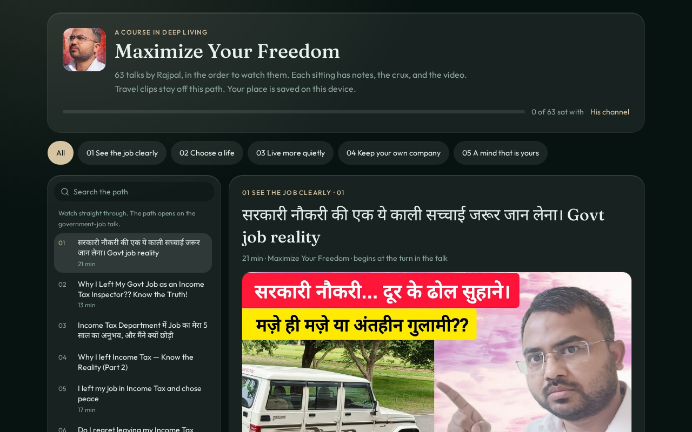

<p align="center">
  
</p>

<h1 align="center">Maximize Your Freedom</h1>

<p align="center">
  A course in deep living. Sixty-three public talks by Rajpal, in the order to watch them.<br>
  Each sitting has the video, notes, and the crux. Travel clips stay off this path.
</p>

<p align="center">
  <a href="https://boss974829.github.io/freedom/"><strong>Open the course</strong></a>
  &nbsp;·&nbsp;
  <a href="https://www.youtube.com/@MaximizeYourFreedom">His channel</a>
  &nbsp;·&nbsp;
  <a href="https://github.com/boss974829/freedom">Source</a>
</p>

<p align="center">
  
  
  
</p>

This is a study guide, not the official channel. The videos remain on YouTube. If a sitting is about distress, it is not care — speak to someone near you.

## The path

Watch straight through. The path opens on the government-job talk.

| | Phase | Sittings | What it is for |
| --- | --- | ---: | --- |
| 01 | See the job clearly | 18 | A government post looks finished from far away. These talks are the inside: Income Tax, the exam years, and the difference between stability and a life. |
| 02 | Choose a life | 11 | Marriage, children, old age, and a single life, without the script that arrives the moment a salary does. |
| 03 | Live more quietly | 14 | Sukoon, fewer things, worry, midlife, and a normal day you can actually sit inside. |
| 04 | Keep your own company | 9 | What people will say, thin friendships, and a personality that does not borrow its nerve. |
| 05 | A mind that is yours | 11 | Festivals, phones, karma, and belief, looked at without handing the evening to a crowd. |

## What you can do

- Move through the talks in order, or filter by phase.
- Search titles, notes, and the crux.
- Read the notes, then the few lines worth keeping.
- Watch in the page. Age-restricted talks open on YouTube, with the notes still here.
- Mark a sitting with **I sat with this**. The place is kept on this device (`localStorage`), not in an account.
- Jump back to a talk from the URL hash.

## Run it locally

Node 22. From the repo root:

```bash
npm install
npm run dev
```

The app listens on port 8080. `npm run build` produces the production bundle. `npm test` covers the small pure helpers.

The course itself lives in [`src/data/course.json`](src/data/course.json). The screen is [`src/components/course-app.tsx`](src/components/course-app.tsx).

## Stack

React 19, TanStack Start and Router, Tailwind 4, and a dark ink-and-gold layout set in Fraunces and Outfit. No sign-in. Progress never leaves the browser.

## Website

The same path is hosted, with notes, the crux, and the videos:

**[boss974829.github.io/freedom](https://boss974829.github.io/freedom/)**

The page in [`docs/`](docs/) is that site. It reads the course file from this repo.
